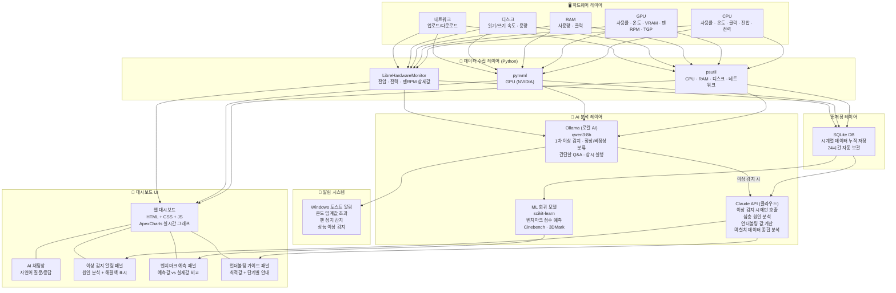
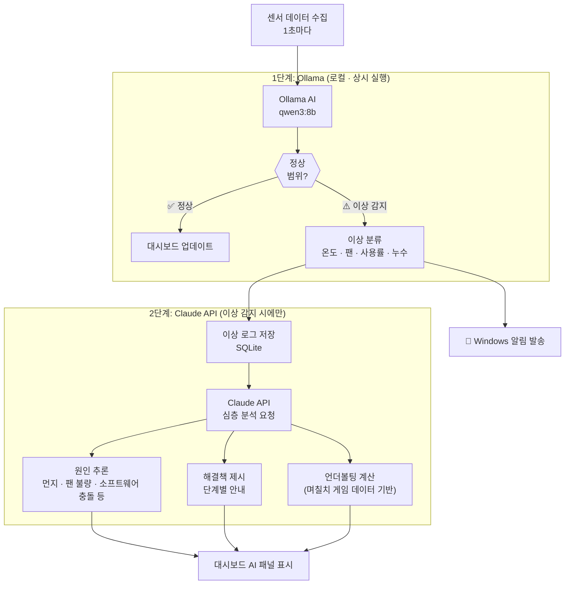
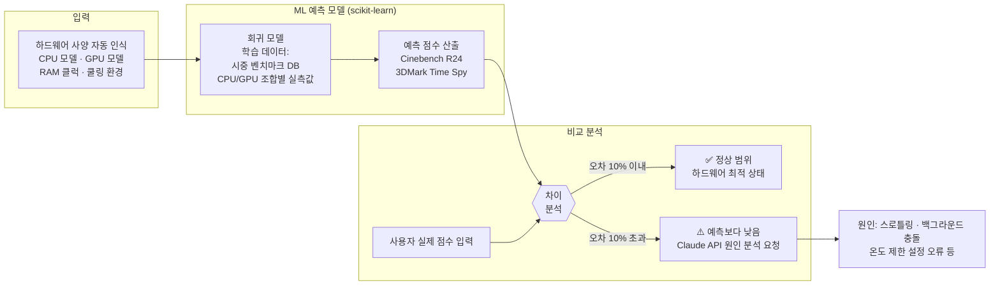
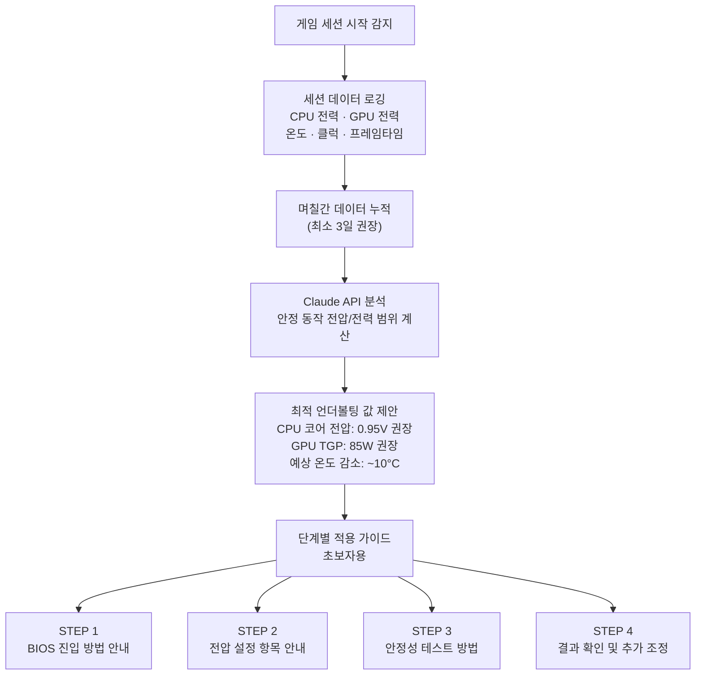
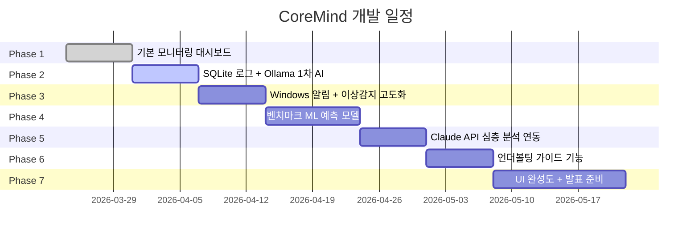
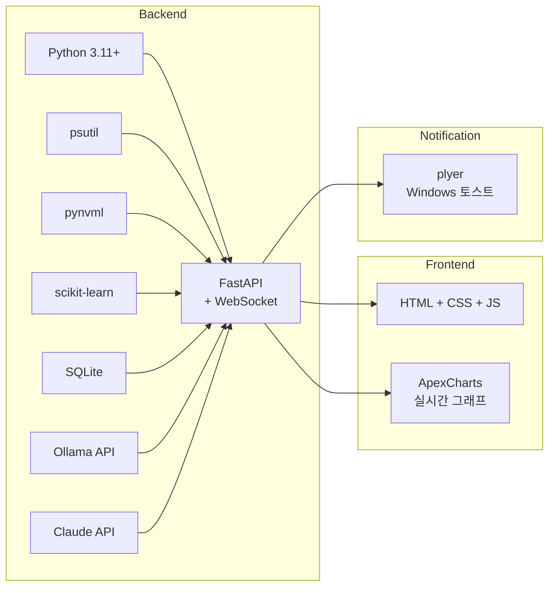

# HardSense
AI-Powered Hardware Monitoring Assistant

# ⬡ CoreMind — AI 하드웨어 모니터링 비서
### 프로젝트 기획서 (캡스톤 디자인)

---

## 1. 프로젝트 개요

### 1.1 프로젝트 명

**CoreMind** — AI-Powered Hardware Monitoring Assistant

### 1.2 한 줄 정의

> 수치를 보여주는 것을 넘어, AI가 하드웨어 상태를 **이해하고, 예측하고, 최적화**까지 도와주는 지능형 PC 하드웨어 모니터링 비서

### 1.3 기존 소프트웨어와의 차이점

| 구분 | RivaTuner / HWiNFO | **CoreMind** |
|------|-------------------|--------------|
| 데이터 표시 | ✅ 수치만 표시 | ✅ 수치 + 의미 해석 |
| AI 분석 | ❌ | ✅ 2단계 AI 구조 |
| 이상 원인 설명 | ❌ | ✅ 자동 원인 추론 |
| 해결책 제시 | ❌ | ✅ 단계별 안내 |
| 벤치마크 예측 | ❌ | ✅ ML 기반 점수 예측 |
| 언더볼팅 가이드 | ❌ | ✅ 실사용 데이터 기반 자동 계산 |
| 상시 백그라운드 실행 | ❌ (게임 시만) | ✅ 항상 실행 |

---

## 2. 프로젝트 목적

### 2.1 배경

현재 시중에 출시된 하드웨어 모니터링 소프트웨어(RivaTuner, HWiNFO, MSI Afterburner 등)는 단순히 수치를 시각화하는 역할에 그친다. 사용자는 CPU가 92°C를 표시해도 이것이 위험한지, 왜 높아졌는지, 어떻게 해야 하는지 스스로 판단해야 한다. AI가 일상에 깊숙이 자리 잡은 현재, 이러한 판단을 AI가 대신 수행해주는 도구가 존재하지 않는다.

### 2.2 목적

AI를 하드웨어 모니터링에 접목하여:

- 일반 사용자도 자신의 PC 상태를 **직관적으로 이해**할 수 있도록 한다.
- 이상 징후를 **자동으로 감지하고 원인을 설명**해준다.
- 며칠간의 데이터를 분석해 **언더볼팅 최적값을 제안**함으로써, 초보자도 안전하게 PC를 튜닝할 수 있게 한다.
- **벤치마크 점수를 예측**하여 실제 성능이 기대치에 못 미칠 경우 원인을 분석해준다.

---

## 3. 프로젝트 목표

### 3.1 핵심 목표 (Must Have)

- [x] CPU / GPU / RAM / 디스크 / 네트워크 실시간 모니터링 대시보드 구현
- [x] 로컬 AI (Ollama) 기반 1차 이상 감지 및 자동 경고
- [x] Claude API 기반 심층 원인 분석 및 해결책 제시
- [x] 이상 감지 시 Windows 토스트 알림 발송
- [x] SQLite 기반 시계열 데이터 로깅 (24시간)

### 3.2 확장 목표 (Should Have)

- [ ] ML 회귀 모델 기반 벤치마크 점수 예측 (Cinebench, 3DMark)
- [ ] 실제 벤치마크 결과와 예측값 비교 분석
- [ ] 며칠치 게임 세션 데이터 기반 언더볼팅 최적값 자동 계산
- [ ] 언더볼팅 단계별 가이드 (초보자용)

### 3.3 선택 목표 (Nice to Have)

- [ ] 음성 알림 기능
- [ ] 모바일 접속 대시보드 지원
- [ ] 다중 PC 모니터링 지원

---

## 4. 시스템 블록도

### 4.1 전체 아키텍처

---

### 4.2 AI 2단계 분석 흐름

---

### 4.3 벤치마크 예측 흐름

---

### 4.4 언더볼팅 가이드 흐름

---

## 5. 개발 일정 (Phase별)

---

## 6. 기술 스택 요약

---

## 7. 기대 효과

- PC를 잘 모르는 일반 사용자도 **AI의 설명을 통해 자신의 PC 상태를 쉽게 파악**
- 먼지 쌓임, 팬 불량, 소프트웨어 충돌 등 **발열 원인을 조기에 감지**하여 하드웨어 수명 연장
- 언더볼팅 초보자도 **안전하게 전압/전력 최적화**를 시도할 수 있는 가이드 제공
- 벤치마크 측정 없이 **AI로 예측 점수를 확인**하고, 실제 성능 저하 원인을 파악

---

*이 문서는 캡스톤 디자인 프로젝트 기획 단계 문서입니다.*
