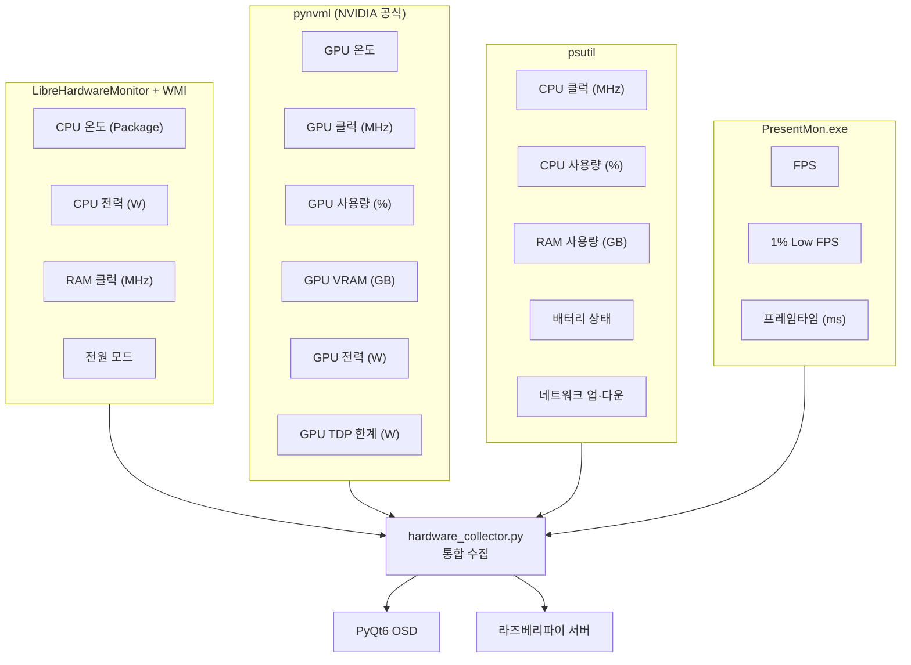
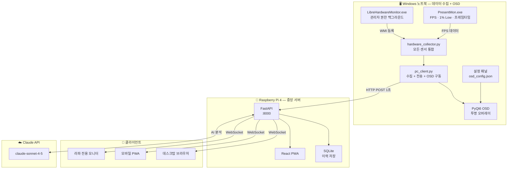
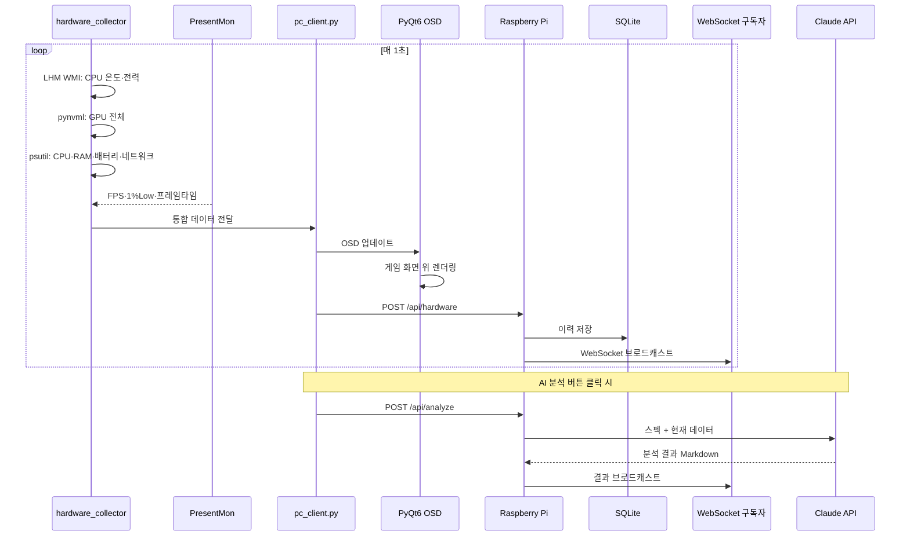
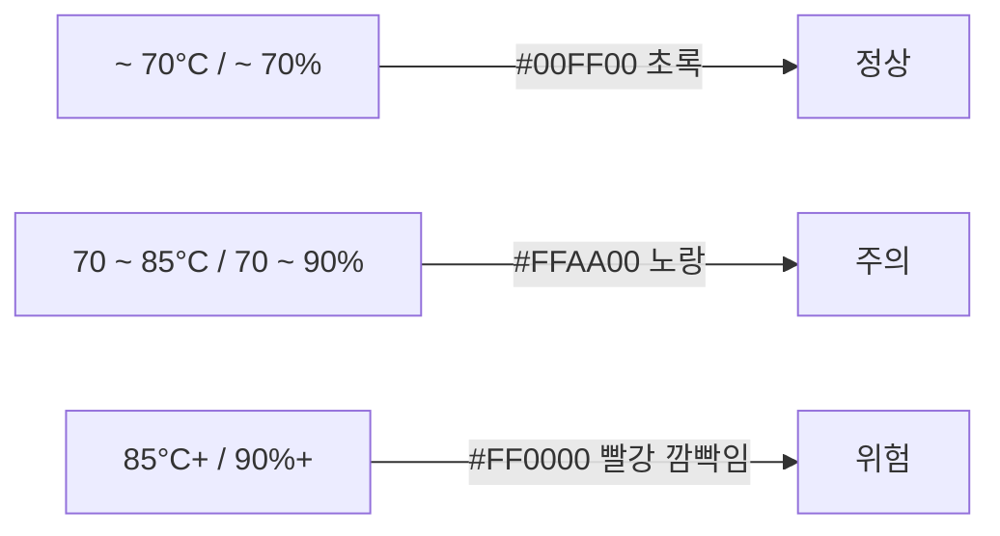
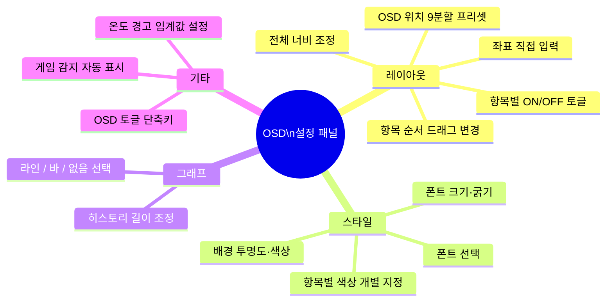
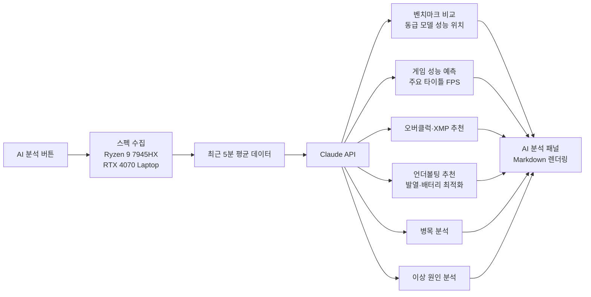
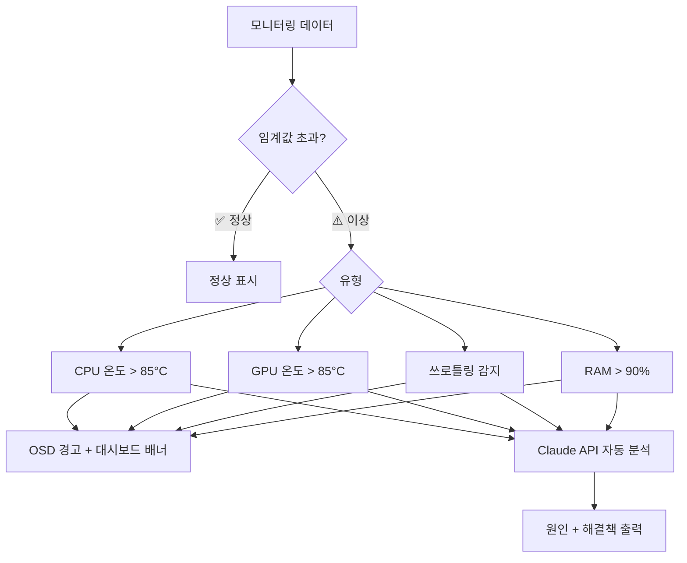
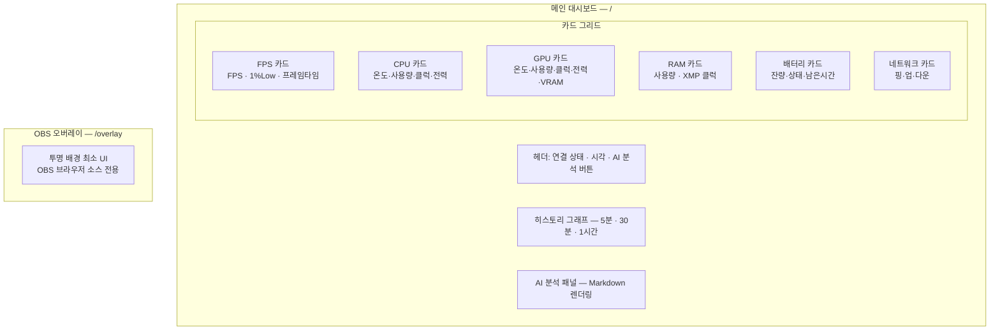
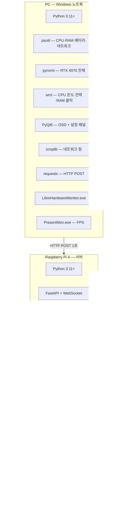
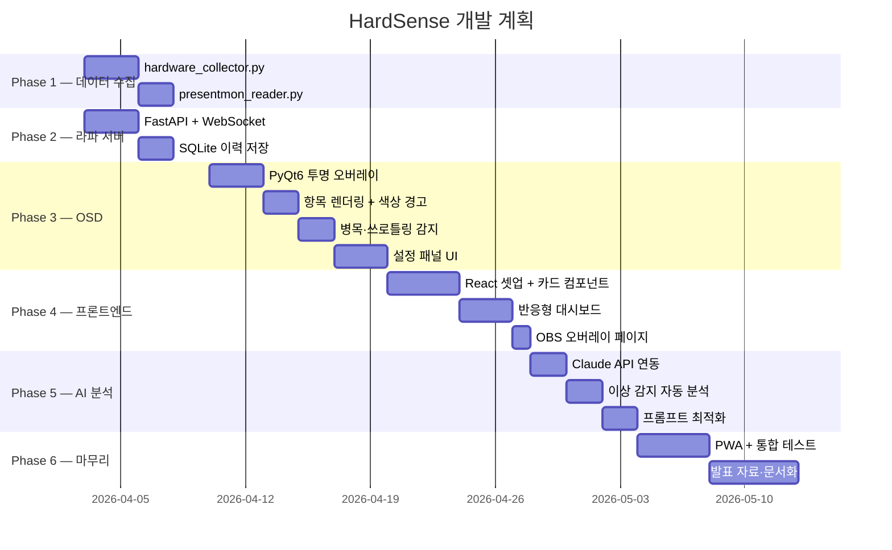

# ⬡ HardSense — AI 하드웨어 모니터링 비서

> **캡스톤 디자인 프로젝트** | 2101091 최윤식
> 최초 작성: 2026년 03월 24일 | 최종 수정: 2026년 04월 02일

---

## 1. 프로젝트 개요

### 1.1 한 줄 정의

> 실시간 하드웨어 데이터를 게임 화면 위에 커스텀 OSD로 표시하고,
> Claude AI가 하드웨어 상태를 **이해·분석·최적화**까지 도와주는 지능형 PC 하드웨어 모니터링 비서

### 1.2 개발 환경 하드웨어

| 구분 | 사양 |
|------|------|
| CPU | AMD Ryzen 9 7945HX |
| GPU | NVIDIA RTX 4070 Laptop |
| OS | Windows 11 (노트북) |
| 서버 | Raspberry Pi 4 |

### 1.3 기존 소프트웨어와의 차이점

| 구분 | RivaTuner / HWiNFO | **HardSense** |
|------|-------------------|---------------|
| OSD 표시 | ✅ 고정 레이아웃 | ✅ 완전 커스텀 (순서·폰트·색·그래프) |
| AI 분석 | ❌ | ✅ Claude API 심층 분석 |
| 병목 표시 | ❌ | ✅ CPU/GPU 병목 자동 판단 |
| 쓰로틀링 감지 | ❌ | ✅ 실시간 감지 + 경고 |
| 온도 색상 경고 | ❌ | ✅ 수치별 색상 자동 변환 |
| 배터리 표시 | ❌ | ✅ 잔량·충전상태·남은시간 |
| 모바일 대시보드 | ❌ | ✅ PWA 지원 |
| 분산 서버 구조 | ❌ | ✅ 라즈베리파이 중앙 서버 |

### 1.4 하드웨어 구성

```
[Windows 노트북]  ──────────────►  [Raspberry Pi 4]
 데이터 수집 + OSD 렌더링              중앙 서버 + 웹 대시보드
 (psutil / pynvml / WMI / LHM)        (FastAPI + SQLite + React)
 (PyQt6 OSD / PresentMon)                     │
                               ┌──────────────┼──────────────┐
                               ▼              ▼               ▼
                        데스크탑 브라우저  모바일 PWA    라파 전용 모니터
```

---

## 2. 데이터 수집 방식 확정

### 2.1 항목별 수집 방법

| 항목 | 수집 방법 | 비고 |
|------|-----------|------|
| CPU 온도 | LHM + WMI | `CPU Package` 센서 |
| CPU 전력 (W) | LHM + WMI | AMD 전력 센서 안정적 |
| CPU 클럭 (MHz) | psutil | `cpu_freq().current` |
| CPU 사용량 (%) | psutil | 전체 + 코어별 |
| GPU 온도 | pynvml | RTX 4070 직접 지원 |
| GPU 클럭 (MHz) | pynvml | `NVML_CLOCK_GRAPHICS` |
| GPU 사용량 (%) | pynvml | `getUtilizationRates` |
| GPU VRAM (GB) | pynvml | `getMemoryInfo` |
| GPU 전력 (W) | pynvml | `getPowerUsage` |
| GPU TDP 한계 (W) | pynvml | `getEnforcedPowerLimit` |
| RAM 사용량 (GB) | psutil | `virtual_memory` |
| RAM 클럭 (MHz) | WMI | `ConfiguredClockSpeed` |
| FPS | PresentMon | ETW 기반 실측값 |
| 1% Low FPS | PresentMon | 하위 1% 프레임 |
| 프레임타임 (ms) | PresentMon | 평균 프레임 간격 |
| 배터리 (%) | psutil | `sensors_battery` |
| 배터리 상태 | psutil | 충전 중 / 방전 중 |
| 배터리 남은시간 | psutil | `secsleft` |
| 전원 모드 | WMI | 고성능 / 균형 / 절전 |
| 네트워크 핑 (ms) | icmplib | 8.8.8.8 ICMP |
| 네트워크 업 (Mbps) | psutil | `net_io_counters` |
| 네트워크 다운 (Mbps) | psutil | `net_io_counters` |

### 2.2 수집 주체별 정리



---

## 3. 시스템 아키텍처

### 3.1 전체 블록도



### 3.2 데이터 흐름



---

## 4. OSD 기능 상세

### 4.1 표시 항목 전체 목록

| 항목 | 표시 포맷 | 기본값 | 그래프 |
|------|-----------|--------|--------|
| FPS | `144 fps` | ON | 라인 |
| 1% Low | `1%Low: 98 fps` | ON | 라인 |
| 프레임타임 | `6.9ms` | ON | 라인 |
| CPU 온도 | `72°C` | ON | 라인 |
| CPU 사용량 | `45%` | ON | 라인 |
| CPU 클럭 | `4800MHz` | ON | 라인 |
| CPU 전력 | `95W / 65W TDP` | ON | 라인 |
| GPU 온도 | `68°C` | ON | 라인 |
| GPU 사용량 | `89%` | ON | 라인 |
| GPU 클럭 | `2100MHz` | ON | 라인 |
| GPU 전력 | `85W / 115W TDP` | ON | 라인 |
| VRAM | `8.2 / 8.0GB` | ON | 바 |
| RAM | `14.2 / 32.0GB` | ON | 바 |
| 배터리 | `78% ⚡충전중` | ON | — |
| 배터리 남은시간 | `약 2:14 남음` | ON | — |
| 네트워크 핑 | `12.3ms` | ON | 라인 |
| 네트워크 업 | `↑8 Mbps` | OFF | — |
| 네트워크 다운 | `↓120 Mbps` | OFF | — |
| 현재 시간 | `23:47` | ON | — |
| 세션 타이머 | `1:23:45` | OFF | — |
| 병목 표시 | `병목: GPU` | ON | — |
| 쓰로틀링 감지 | `⚠ GPU 쓰로틀링` | ON | — |

### 4.2 온도·사용량 색상 경고



CPU·GPU 온도, CPU·GPU 사용량, GPU 전력, 배터리 잔량 전부 동일 적용

### 4.3 병목 자동 판단

```
CPU 사용량 >= 90%  AND  GPU 사용량 < 80%  →  병목: CPU
GPU 사용량 >= 90%  AND  CPU 사용량 < 80%  →  병목: GPU
둘 다 >= 80%                               →  병목: CPU+GPU
둘 다 < 80%                                →  표시 없음
```

### 4.4 쓰로틀링 감지

```
GPU 클럭이 최대 대비 20% 이상 급락  →  ⚠ GPU 쓰로틀링
CPU 클럭이 기본 클럭 이하 지속      →  ⚠ CPU 쓰로틀링
GPU 전력이 TDP 한계 도달            →  ⚠ 전력 제한
```

### 4.5 OSD 커스텀 설정



### 4.6 설정 파일 구조 (osd_config.json)

```json
{
  "position": { "x": 10, "y": 10 },
  "width": 220,
  "font": "Consolas",
  "font_size": 14,
  "font_bold": false,
  "bg_color": "#000000",
  "bg_opacity": 0.6,
  "toggle_hotkey": "F12",
  "temp_warn": 70,
  "temp_danger": 85,
  "items": [
    { "id": "fps",        "order": 0,  "show": true,  "graph": "line", "color": "#00FF00" },
    { "id": "fps_low",    "order": 1,  "show": true,  "graph": "line", "color": "#00FF00" },
    { "id": "frametime",  "order": 2,  "show": true,  "graph": "line", "color": "#AAFFAA" },
    { "id": "gpu_temp",   "order": 3,  "show": true,  "graph": "line", "color": "#FF6600" },
    { "id": "gpu_usage",  "order": 4,  "show": true,  "graph": "line", "color": "#FF6600" },
    { "id": "gpu_clock",  "order": 5,  "show": true,  "graph": "line", "color": "#FF9900" },
    { "id": "gpu_power",  "order": 6,  "show": true,  "graph": "line", "color": "#FFCC00" },
    { "id": "vram",       "order": 7,  "show": true,  "graph": "bar",  "color": "#FF6600" },
    { "id": "cpu_temp",   "order": 8,  "show": true,  "graph": "line", "color": "#00AAFF" },
    { "id": "cpu_usage",  "order": 9,  "show": true,  "graph": "line", "color": "#00AAFF" },
    { "id": "cpu_clock",  "order": 10, "show": true,  "graph": "line", "color": "#66CCFF" },
    { "id": "cpu_power",  "order": 11, "show": true,  "graph": "line", "color": "#AADDFF" },
    { "id": "ram",        "order": 12, "show": true,  "graph": "bar",  "color": "#AA88FF" },
    { "id": "battery",    "order": 13, "show": true,  "graph": "none", "color": "#88FF88" },
    { "id": "bat_time",   "order": 14, "show": true,  "graph": "none", "color": "#88FF88" },
    { "id": "net_ping",   "order": 15, "show": true,  "graph": "line", "color": "#FFFFFF" },
    { "id": "net_up",     "order": 16, "show": false, "graph": "none", "color": "#AAAAAA" },
    { "id": "net_down",   "order": 17, "show": false, "graph": "none", "color": "#AAAAAA" },
    { "id": "time",       "order": 18, "show": true,  "graph": "none", "color": "#CCCCCC" },
    { "id": "session",    "order": 19, "show": false, "graph": "none", "color": "#CCCCCC" },
    { "id": "bottleneck", "order": 20, "show": true,  "graph": "none", "color": "#FFFF00" },
    { "id": "throttle",   "order": 21, "show": true,  "graph": "none", "color": "#FF0000" }
  ]
}
```

---

## 5. AI 분석 기능

### 5.1 분석 항목



### 5.2 이상 감지 자동 분석



---

## 6. 웹 대시보드



---

## 7. 기술 스택



---

## 8. API 엔드포인트

| 메서드 | 경로 | 설명 |
|--------|------|------|
| `POST` | `/api/hardware` | PC → 라파 데이터 수신 |
| `GET` | `/api/hardware/latest` | 최신 데이터 조회 |
| `GET` | `/api/hardware/history?minutes=30` | 이력 조회 |
| `WebSocket` | `/ws` | 실시간 브로드캐스트 |
| `POST` | `/api/analyze` | Claude AI 분석 요청 |
| `GET` | `/api/system/info` | PC 스펙 정보 |

---

## 9. 디렉토리 구조

```
HardSense/
│
├── pc_client/
│   ├── pc_client.py              # 메인 — 수집·전송·OSD 구동
│   ├── hardware_collector.py     # LHM·pynvml·psutil 통합 수집
│   ├── presentmon_reader.py      # PresentMon FPS 수집
│   ├── osd_overlay.py            # PyQt6 투명 OSD
│   ├── osd_settings.py           # 설정 패널 UI
│   ├── osd_config.json           # OSD 설정 저장
│   ├── PresentMon.exe            # FPS 수집 도구 동봉
│   └── requirements_pc.txt
│
├── server/
│   ├── main.py
│   ├── routers/
│   │   ├── hardware.py
│   │   ├── analyze.py
│   │   └── websocket.py
│   ├── database.py
│   ├── claude_client.py
│   └── requirements_server.txt
│
├── frontend/
│   ├── src/
│   │   ├── components/
│   │   │   ├── FpsCard.jsx
│   │   │   ├── CpuCard.jsx
│   │   │   ├── GpuCard.jsx
│   │   │   ├── RamCard.jsx
│   │   │   ├── BatteryCard.jsx
│   │   │   ├── NetworkCard.jsx
│   │   │   ├── HistoryChart.jsx
│   │   │   └── AiAnalysisPanel.jsx
│   │   ├── pages/
│   │   │   ├── Dashboard.jsx
│   │   │   └── Overlay.jsx
│   │   ├── hooks/
│   │   │   └── useWebSocket.js
│   │   └── App.jsx
│   ├── public/manifest.json
│   └── package.json
│
└── README.md
```

---

## 10. 개발 단계별 계획



---

## 11. OSD 동작 조건

| 게임 실행 모드 | OSD 동작 | 비고 |
|---------------|---------|------|
| 보더리스 창모드 | ✅ 완벽 동작 | 권장 설정 |
| 창모드 | ✅ 완벽 동작 | |
| 풀스크린 독점 | ❌ 미지원 | 보더리스 전환 권장 |

> Windows 10/11 풀스크린 최적화로 보더리스와 성능 차이 사실상 없음

---

## 12. 기대 결과물

| 결과물 | 설명 |
|--------|------|
| 커스텀 OSD | 게임 화면 위 투명 오버레이, 완전 커스텀 |
| OSD 설정 패널 | 항목·순서·폰트·색·그래프 실시간 조정 |
| 라즈베리파이 서버 | FastAPI REST + WebSocket 중앙 서버 |
| 웹 대시보드 | 실시간 그래프 + AI 분석 패널 |
| 모바일 PWA | 스마트폰 홈 화면 설치 지원 |
| OBS 오버레이 | 브라우저 소스용 최소 UI |
| AI 분석 리포트 | Claude 기반 하드웨어 종합 분석 |

---

*이 문서는 캡스톤 디자인 프로젝트 설계 문서입니다.*
